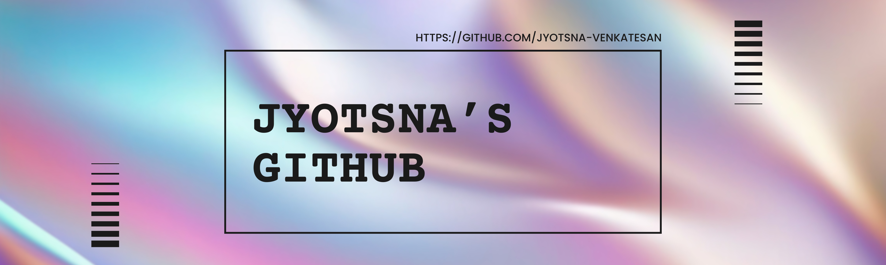

# Jyotsna Venkatesan 🔭

CS student @ PolyU with a fixation of creating websites I find meaningful. Mostly building with React, Vue, and Svelte to bring ideas to life.

## Tech Stack

## Github Stats <3

    

<picture>
  <source media="(prefers-color-scheme: dark)" srcset="https://raw.githubusercontent.com/tobiasmeyhoefer/tobiasmeyhoefer/output/github-snake-dark.svg" />
  <source media="(prefers-color-scheme: light)" srcset="https://raw.githubusercontent.com/tobiasmeyhoefer/tobiasmeyhoefer/output/github-snake.svg" />
  
</picture>
